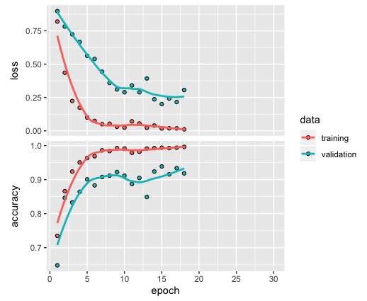

---
output:
  pdf_document: default
  html_document: default
---

# 3-Classes images classification problem

## 3.1 Analyse de données
Après examiner les données, on trouve que les données sont des images colorées en tailles différentes. Pour l'ordinateur ils sont des matrice de dimension $x\times y\times3$ avec des $x$ et $y$ différents. Par conséquent il faut régler les tailles des données avant entraîner le modèl. Dans notre cas nous les avons réglés en $100\times100\times3$ Puis enlever des points qui ne portent pas trop d'information, c'est-à-dire des points ayant une variance très petite parmi des images. Pour certaines méthodes il faut aussi transformer des images en gris.
## 3.2 Choix du modèle
### 3.2.1 Support Vector Machine
Support Vector Machine (SVM) est un outil très fort en problèmes de classification non-linéaire. Pour appliquer SVM sur ce problème, les images sont transformés en gris, donc des matrices $100\times 100$. Puis la matrice est transformée en un vecteur de dimention $10000$, qui sont des "vraies entrées".
Comme il y a trop de dimensions dans les données d'entrées, nous avons pensé à diminuer la dimension par retirer des pixels non-informatif (les pixels dont la variance est très petit), mais nous avons trouvé que tous les pixels ont des variances similaires. C'est différent que le problème d'expressions que nous avons traité, parce que dans cette situation les images sont plus complexes. 
Le résultat de SVM n'est pas satisfaisant. Le taux d'erreur était environ $0.4$. Donc nous décidons d'aller chercher une meilleure solution.

### 3.2.2 Multilayer Perceptron
Multilayer Perceptron (MLP) est un réseau de neurones très simple. Il est consisté avec des couches des neurones. Pour chaque couche, une "caractéristique" est extraite et utilisée pour déterminer des caractéristiques de la couche suivant. Il est plus raisonnable d'utiliser un MLP pour traiter des images, car même si pour les êtres-humain, nous classifions des images par caractéristiques.
En MLP nous prétraitons des images comme en SVM, donc la première couche de neurones est composé de $10000$ neurones. Néanmoins, la précision de validation du modèle MLP varie beaucoup. Il n'augmente pas avec les epochs comme prévu. Nous avons ajouté plus de couches mais ce ne fait rien.
Un modèle MLP est bon en terme d'extraction des caractéristiques donc il est bon pour les classifications des images simples tel que des chiffres écrits. Il ne prend pas en compte des relations parmi des pixels ajacents.

### 3.2.3 Convolutional Neural Networks
Convolutional Neural Networks (CNN) est très célèbre pour son abilité d'apprentissage en traitement des images. Chaque fois il prend en compte des pixels ajacents donc il est parfait pour traiter des données 2-dimensionnels comme image. Grâce au package `keras`, nous pouvons construire un CNN avec facilité.

#### 3.2.3.1 Structure de CNN
Nous avons construit un CNN assez simple, mais très fort. Il est composé d'une couche de convolution avec un noyau de $3\times 3$ et une couche de pooling.
```{r echo=FALSE}
setwd("~/code/dataset-learningMethods")
library(keras)
modelCNN = load_model_hdf5("modelCNN.h5", compile = TRUE)
summary(modelCNN)
```
#### 3.2.3.2 Traitement des données
Pour faire la validation au même temps d'apprentissage, nous avons divisés des données en deux groupes : l'un pour entraînement et l'autre pour validation. Toute les images sont mise en $100\times 100\times 3$ pour l'apprentissage. Pour le CNN, il n'est pas nécessaire d'éliminer la dimension couleur donc il garde plus d'informations. Nous avons aussi trouvé des autres images sur internet pour tester.

#### 3.2.3.3 Apprentissage
L'apprentissage d'un CNN est en époques et en chaque époque, seulement un lot d'images est utilisé. Le nombre d'époque ne doit être ni trop grand car il prend trop de temps, ni trop petit car le modèle peut être subappris. $30$ est un nombre juste pour ce problème.
Pour éviter le surapprentissage, nous avons défini une fonction de rappel qui termine l'apprentissage lorsque la fonction de perte de validation commence à augmenter.
Le résultat est satisfaisant, comme nous avons obtenu une précision de validation de plus de $92\%$.


## 3.3 Conclusion
Après essayer les trois modèles, il est sans doute que le CNN est le meilleur pour la classification des images.